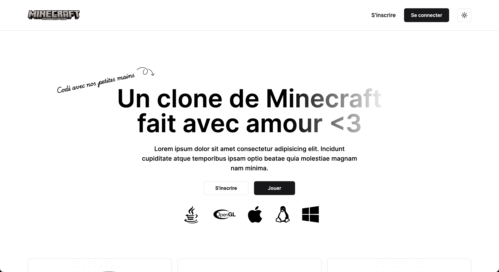

# Next Minecraft Clone Web App (In construction)

Next.js web application for my Minecraft Clone game project.


### Built With

- [![Next][NextJS]][Next-url]
- [![React][React.js]][React-url]
- [![TS][Typescript]][Typescript-url]
- [![Prisma][Prisma]][Prisma-url]
- [![Tailwind][TailwindCSS]][Tailwindcss-url]

# Live Demo

A live demo is availaible [here](https://next-mccloneapp.vercel.app/)

## Getting Started

### Installation

1. Clone the repo

```sh
git clone https://github.com/NaimanMpl/next-mccloneapp.git
```

2. Use NVM to get the right version of Node needed for the project

```sh
nvm install
nvm use
```

3. Install npm packages

```sh
npm install
```

4. Get a PostgreSQL server with Docker. (By default port is 5432)

```sh
docker-compose up -d
```

5. Push the Prisma schema to your database

```sh
npx prisma db push
```

6. Fill the database with default values with the initialisation script.

```sh
npx prisma db seed
```

7. Apply migrations

```sh
npx prisma migrate dev
```

## License

Distributed under the MIT License. See `LICENSE.txt` for more information.

[Typescript]: https://img.shields.io/badge/TypeScript-007ACC?style=for-the-badge&logo=typescript&logoColor=white
[Typescript-url]: https://www.typescriptlang.org/
[Node.js]: https://img.shields.io/badge/Node.js-43853D?style=for-the-badge&logo=node.js&logoColor=white
[Nodejs-url]: https://nodejs.org/en
[React.js]: https://img.shields.io/badge/React-20232A?style=for-the-badge&logo=react&logoColor=61DAFB
[React-url]: https://reactjs.org/
[SASS]: https://img.shields.io/badge/Sass-CC6699?style=for-the-badge&logo=sass&logoColor=white
[Sass-url]: https://sass-lang.com/
[Tailwindcss-url]: https://tailwindcss.com/
[TailwindCSS]: https://img.shields.io/badge/Tailwind_CSS-38B2AC?style=for-the-badge&logo=tailwind-css&logoColor=white
[NextJS]: https://img.shields.io/badge/next.js-000000?style=for-the-badge&logo=nextdotjs&logoColor=white
[Next-url]: https://nextjs.org/
[Prisma]: https://img.shields.io/badge/Prisma-3982CE?style=for-the-badge&logo=Prisma&logoColor=white
[Prisma-url]: https://www.prisma.io/
